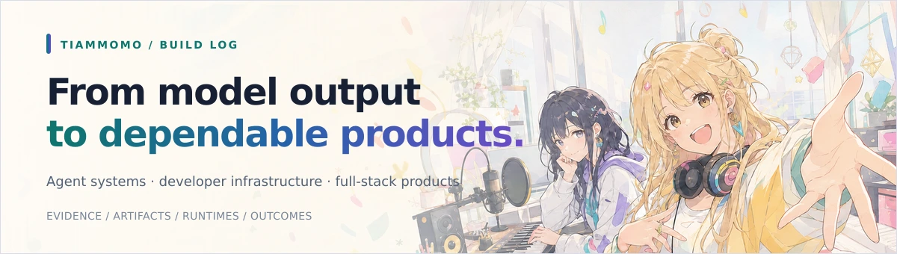
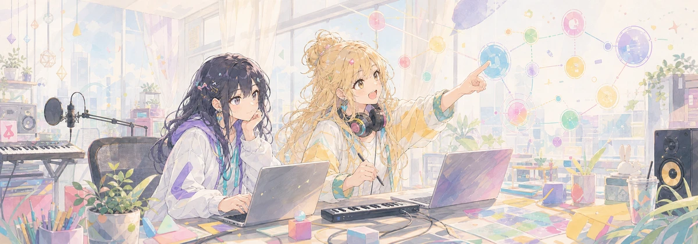

  
  

## Hello, I'm Tiammomo

I'm an **AI-native product builder** working where agent systems, developer infrastructure, and full-stack product engineering meet. I like taking an idea past the demo stage: explicit contracts, observable runtimes, durable state, safety boundaries, and a product people can actually use.

## What I build

<table>
  <tr>
    <td width="33%" valign="top">
      <h3>Agent systems</h3>
      
Evidence-aware agents, versioned artifacts, resumable runs, long-term memory, RAG, and human review loops.

    </td>
    <td width="33%" valign="top">
      <h3>Developer infrastructure</h3>
      
Model gateways, protocol adapters, routing, quotas, observability, security boundaries, and deployment tooling.

    </td>
    <td width="33%" valign="top">
      <h3>AI-native products</h3>
      
End-to-end workspaces that turn research, data, and generated content into traceable product workflows.

    </td>
  </tr>
</table>

## Engineering fingerprints

- **Evidence before confidence** — sources, provenance, and outcomes should remain inspectable.
- **Artifacts before prose** — important state belongs in typed, versioned contracts instead of transient model text.
- **Boundaries before scale** — authentication, isolation, quotas, failure modes, and operational limits are product features.
- **Products before demos** — the interface, recovery path, documentation, and quality gate matter as much as the model call.

## Toolbox

  
  
  
  
  
  
  
  
  
  
  
  

## Elsewhere

- **Portfolio & project notes:** [tiammomo.github.io](https://tiammomo.github.io/)
- **Location:** China · UTC+8

  Build patiently. Verify relentlessly. Keep what works.

