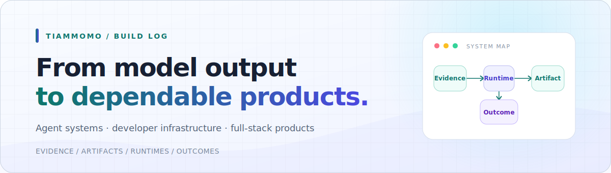

<picture>
  <source media="(prefers-color-scheme: dark)" srcset="./assets/profile-hero-dark.svg">
  <source media="(prefers-color-scheme: light)" srcset="./assets/profile-hero-light.svg">
  
</picture>

  
  
  

## Hello, I'm Tiammomo

I'm an **AI-native product builder** working where agent systems, developer infrastructure, and full-stack product engineering meet. I like taking an idea past the demo stage: explicit contracts, observable runtimes, durable state, safety boundaries, and a product people can actually use.

## What I build

<table>
  <tr>
    <td width="33%" valign="top">
      <h3>Agent systems</h3>
      
Evidence-aware agents, versioned artifacts, resumable runs, long-term memory, RAG, and human review loops.

    </td>
    <td width="33%" valign="top">
      <h3>Developer infrastructure</h3>
      
Model gateways, protocol adapters, routing, quotas, observability, security boundaries, and deployment tooling.

    </td>
    <td width="33%" valign="top">
      <h3>AI-native products</h3>
      
End-to-end workspaces that turn research, data, and generated content into traceable product workflows.

    </td>
  </tr>
</table>

## Selected work

<table>
  <tr>
    <td width="50%" valign="top">
      <h3><a href="https://github.com/tiammomo/RoutePilot">RoutePilot</a></h3>
      
An artifact-first multi-agent workspace for travel questions and decisions, with sourced answers, structured planning, deterministic validation, and versioned trip snapshots.

      
<code>Next.js</code> <code>FastAPI</code> <code>PostgreSQL</code> <code>Redis</code> <code>A2A</code>

      
    </td>
    <td width="50%" valign="top">
      <h3><a href="https://github.com/tiammomo/ModelPort">ModelPort</a></h3>
      
A self-hosted Anthropic-compatible model gateway for Claude Code and API clients, with provider routing, Tool Use conversion, authentication, quotas, health, and request observability.

      
<code>Rust</code> <code>React</code> <code>PostgreSQL</code> <code>Prometheus</code> <code>Docker</code>

      
    </td>
  </tr>
  <tr>
    <td width="50%" valign="top">
      <h3><a href="https://github.com/tiammomo/QuantPilot">QuantPilot</a></h3>
      
An AI workspace for quantitative research and financial-data analysis that produces executable workspaces and tightens results through automated validation, visual inspection, and evaluation.

      
<code>TypeScript</code> <code>Python</code> <code>TimescaleDB</code> <code>Redis</code> <code>Agent Runtime</code>

      
    </td>
    <td width="50%" valign="top">
      <h3><a href="https://github.com/tiammomo/MuseForge">MuseForge</a></h3>
      
A local-first AI image production workspace for e-commerce teams, connecting product truth, structured prompts, batch generation, candidate review, and canvas refinement.

      
<code>React</code> <code>TypeScript</code> <code>FastAPI</code> <code>Konva</code> <code>SQLite</code>

      
    </td>
  </tr>
  <tr>
    <td colspan="2" valign="top">
      <h3><a href="https://github.com/tiammomo/evolvable-user-memory">Evolvable User Memory</a></h3>
      
An evidence-driven, outcome-aware memory service for AI applications. It keeps observations, current beliefs, recall traces, real outcomes, and bounded strategy evolution separate so retrieval alone cannot create a self-reinforcing belief loop.

      
<code>Python</code> <code>FastAPI</code> <code>Domain-driven design</code> <code>Immutable revisions</code> <code>Explainable recall</code>

      
    </td>
  </tr>
</table>

## Engineering fingerprints

- **Evidence before confidence** — sources, provenance, and outcomes should remain inspectable.
- **Artifacts before prose** — important state belongs in typed, versioned contracts instead of transient model text.
- **Boundaries before scale** — authentication, isolation, quotas, failure modes, and operational limits are product features.
- **Products before demos** — the interface, recovery path, documentation, and quality gate matter as much as the model call.

## Toolbox

  
  
  
  
  
  
  
  
  
  
  
  

## Elsewhere

- **Portfolio & project notes:** [tiammomo.github.io](https://tiammomo.github.io/)
- **All open-source work:** [github.com/tiammomo?tab=repositories](https://github.com/tiammomo?tab=repositories)
- **Location:** China · UTC+8

  Build patiently. Verify relentlessly. Keep what works.

