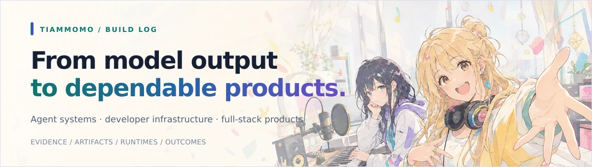

  
  
  

## Hello, I'm Tiammomo

I'm an engineer working on **agent algorithms** and the systems around them. My current work focuses on how agents plan and split work, choose tools and models, retrieve useful memory, coordinate with other agents, and learn from execution traces.

I care about the unglamorous parts too: evaluation, durable state, recovery, observability, and safety boundaries. A useful agent should be able to explain what it did and recover when something goes wrong.

## Agent work

<table>
  <tr>
    <td width="50%" valign="top">
      <h3>Planning and orchestration</h3>
      
I decompose long tasks, route tools and models, and coordinate specialized agents.

      
<code>Python</code> · <code>structured outputs</code> · <code>tool protocols</code>

    </td>
    <td width="50%" valign="top">
      <h3>Learning from runs</h3>
      
I turn execution trajectories into reusable skills and memory, then retrieve them with ranking, clustering, and vector search.

      
<code>RAG</code> · <code>Milvus</code> · <code>PostgreSQL</code> · <code>Redis</code>

    </td>
  </tr>
  <tr>
    <td width="50%" valign="top">
      <h3>Evaluation and runtime</h3>
      
I replay failures, enforce deterministic contracts, profile hot paths, and keep interrupted runs resumable.

      
<code>Python</code> · <code>Rust</code> · <code>Docker</code> · <code>Prometheus</code>

    </td>
    <td width="50%" valign="top">
      <h3>Product surfaces</h3>
      
I expose agent state, evidence, and evaluation results in workflows people can inspect and control.

      
<code>TypeScript</code> · <code>React</code> · <code>Next.js</code> · <code>FastAPI</code>

    </td>
  </tr>
</table>

## Open-source work

In 2026, I've landed **63+ pull requests in repositories I don't own**. Recent work covers runtime contracts, durable state, performance, CI, provider integrations, and desktop/mobile reliability.

<table>
  <tr>
    <td width="50%" valign="top">
      <h3><a href="https://github.com/SkillNerds/xskill">SkillNerds/xskill</a></h3>
      
Agent/task runtimes, incremental indexes, performance contracts, reliability, and CI.

      
    </td>
    <td width="50%" valign="top">
      <h3><a href="https://github.com/makecindy/cindy">makecindy/cindy</a></h3>
      
Desktop/mobile reliability, provider routing, session state, and tool transport.

      
    </td>
  </tr>
</table>

  Also contributed to <a href="https://github.com/bytedance/deer-flow">DeerFlow</a>, <a href="https://github.com/deer-flow/llm-space">llm-space</a>, <a href="https://github.com/LazyAGI/LazyLLM">LazyLLM</a>, and <a href="https://github.com/moyuan-research/moyuan-website">Moyuan Research</a>. <a href="https://github.com/search?q=author%3Atiammomo+is%3Apr+is%3Amerged+-user%3Atiammomo+merged%3A%3E%3D2026-01-01&type=pullrequests">Browse all external merged PRs</a>.

## Selected projects

<table>
  <tr>
    <td width="50%" valign="top">
      <h3><a href="https://github.com/tiammomo/ModelPort">ModelPort</a></h3>
      
A self-hosted Anthropic-compatible model gateway for Claude Code, provider routing, quotas, observability, and team-owned policy.

      

        
        
      

    </td>
    <td width="50%" valign="top">
      <h3><a href="https://github.com/tiammomo/QuantPilot">QuantPilot</a></h3>
      
A workspace that turns natural-language requests into traceable stock analysis, screening, backtests, portfolio insights, and interactive dashboards.

      

        
        
      

    </td>
  </tr>
</table>

## GitHub Roast

  

  Build patiently. Verify relentlessly. Keep what works.

